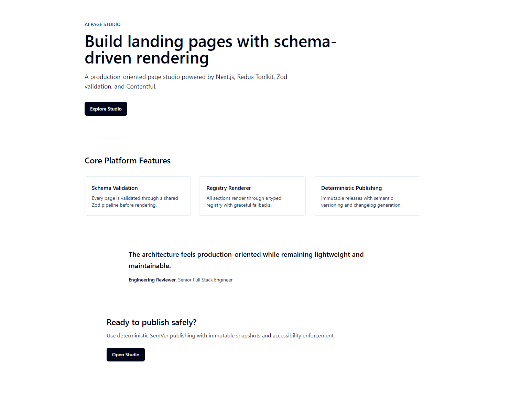
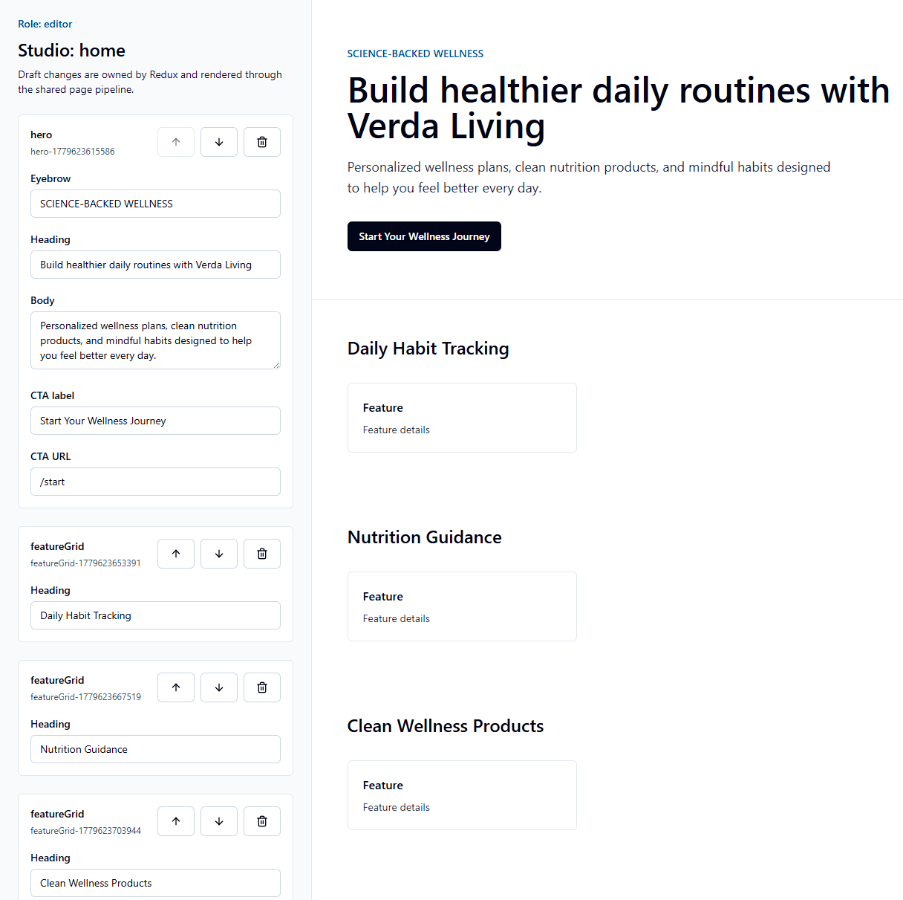
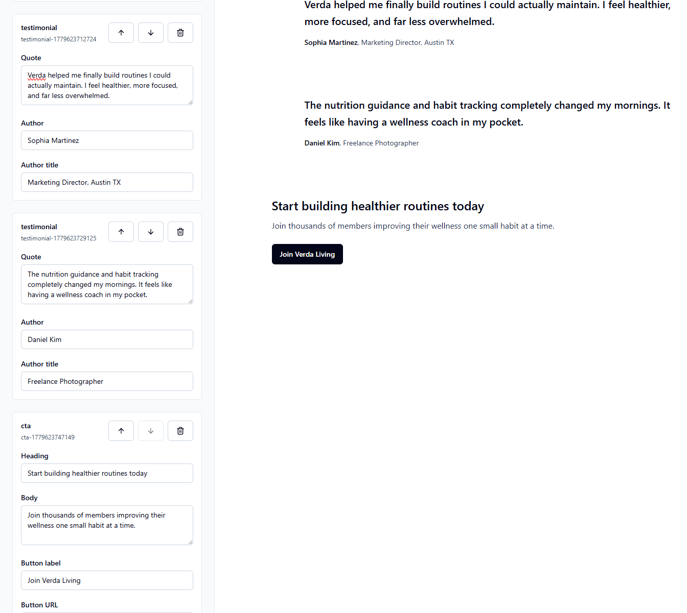
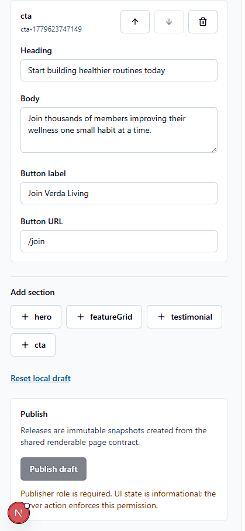
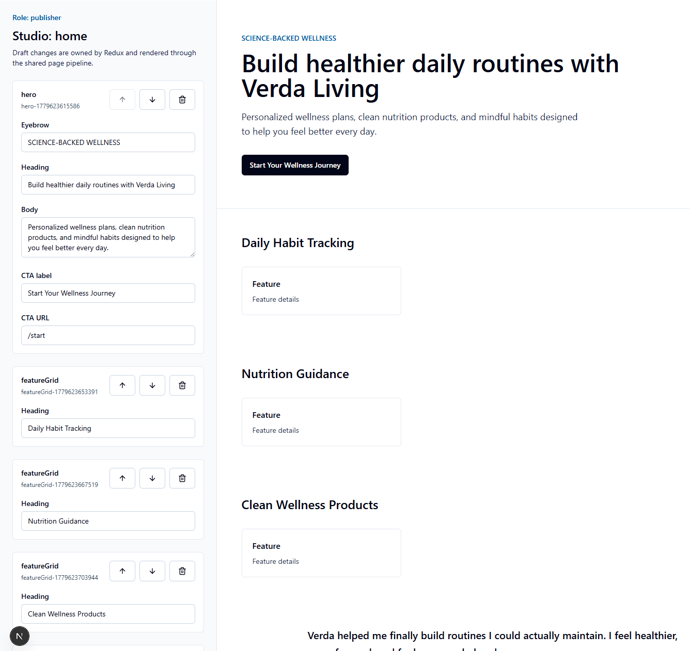
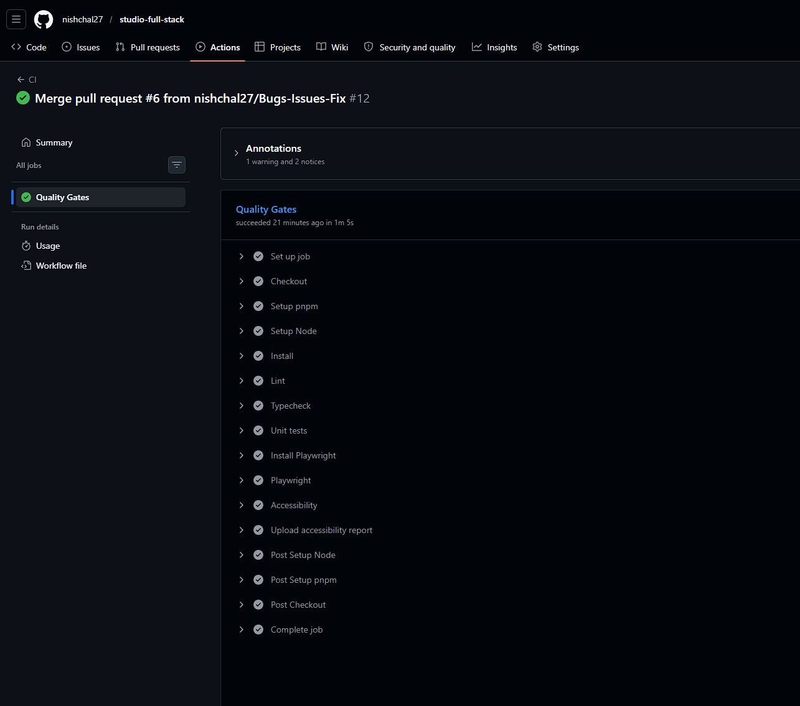

# Page Studio

Production-oriented Page Studio assignment built with Next.js App Router, TypeScript, Redux Toolkit, Contentful, Zod, TailwindCSS, Playwright, axe, and GitHub Actions.

The implementation focuses on a schema-driven rendering architecture with deterministic editing and publishing workflows. Content enters through Contentful, is normalized and validated into a stable renderable contract, and renders through a typed section registry with graceful fallback behavior.

## Live Demo

- Deployment: `TODO: add deployed Vercel URL`
- Repository: `TODO: add GitHub repository URL`

## Core Features

- Schema-driven page rendering with Zod runtime validation
- Contentful adapter with published and preview content support
- Shared renderable page pipeline used by Preview, Studio, and Publish
- Typed section registry for `hero`, `featureGrid`, `testimonial`, and `cta`
- Redux-powered Studio editing with local draft persistence
- Deterministic SemVer publishing and changelog generation
- Immutable release snapshots at `releases/<slug>/<version>.json`
- Lightweight RBAC for `viewer`, `editor`, and `publisher`
- Playwright + axe accessibility enforcement
- GitHub Actions quality gates for lint, typecheck, unit tests, e2e, and accessibility

## Architecture Overview

```txt
Contentful
  -> adapter normalization
  -> shared renderable pipeline
  -> Zod validation
  -> RenderablePage
  -> typed section registry
  -> Preview / Studio / Publish
```

The UI never renders raw CMS data. Preview receives Contentful data, Studio receives Redux draft data, and publishing receives draft data, but all three pass through the same renderable page contract before rendering or snapshotting.

## Screenshots

### Preview Page



### Studio Editor





### RBAC States





### CI and Accessibility



## Publishing Workflow

```txt
Redux draft
  -> renderable pipeline
  -> diff engine
  -> SemVer calculation
  -> changelog
  -> immutable snapshot
```

Versioning rules are deterministic:

- Patch: text and prop updates
- Minor: added sections or additive structural changes
- Major: removed sections, section type changes, or breaking structural changes

Publishing is idempotent. Identical drafts return the existing release snapshot and do not create duplicate versions.

## RBAC

The assignment uses an intentionally lightweight mocked role layer:

- `viewer`: cannot access Studio
- `editor`: can edit drafts, cannot publish
- `publisher`: can edit drafts and publish immutable releases

Studio access is enforced by Next proxy route protection. Publishing is enforced server-side by the protected publish action. Query-param role switching is available for walkthroughs, for example `/studio/home?role=publisher`, without adding authentication infrastructure.

## Accessibility & CI

Accessibility checks are integrated through Playwright and axe. The accessibility suite covers Preview, Studio, keyboard reachability, and reduced-motion behavior, then writes `a11y-report.json`.

GitHub Actions validates:

- `pnpm lint`
- `pnpm typecheck`
- `pnpm test`
- `pnpm test:e2e`
- `pnpm test:a11y`
- `pnpm build`

The accessibility report is uploaded as a CI artifact.

## Tradeoffs & Design Decisions

- Mocked auth is intentionally lightweight. The goal is authorization boundaries, not provider integration.
- Release snapshots are local JSON files to keep publishing deterministic and reviewable without adding a database.
- Contentful sections are JSON-driven and normalized into renderer-safe props. This keeps the CMS model simple while preserving runtime validation.
- Preview, Studio, and Publish share the same renderable pipeline to avoid renderer/editor divergence.
- Drag-and-drop, CMS writeback, and production auth providers were intentionally avoided to keep scope aligned with the assignment.
- Unsupported section fallback remains explicit so unknown CMS content does not crash rendering.

## Local Development

```bash
pnpm install
pnpm dev
```

Useful checks:

```bash
pnpm format
pnpm lint
pnpm typecheck
pnpm test
pnpm test:e2e
pnpm test:a11y
pnpm build
```

## Environment Variables

See [.env.example](.env.example).

```txt
CONTENTFUL_SPACE_ID=
CONTENTFUL_DELIVERY_TOKEN=
CONTENTFUL_PREVIEW_TOKEN=
CONTENTFUL_ENVIRONMENT=master
```

Contentful variables are used only by the isolated adapter layer. Missing configuration fails gracefully in Preview and Studio draft loading.

## Documentation

- [Architecture](docs/architecture.md)
- [Implementation Plan](docs/implementation-plan.md)
- [Content Model](docs/content-model.md)
- [Publishing Flow](docs/publishing-flow.md)
- [Accessibility](docs/accessibility.md)
- [Developer Notes](docs/developer-notes.md)

## Final Notes

This repository is structured as an engineering assignment submission: scoped, typed, validated, accessible, and intentionally maintainable. The implementation favors explicit contracts and deterministic workflows over feature breadth.
